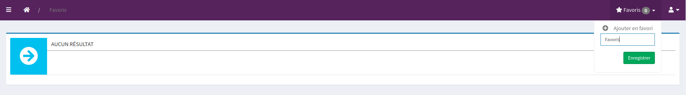
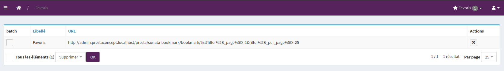

# PrestaSonataBookmarksBundle

PrestaSonataBookmarksBundle will allow your Sonata users to save bookmarks in admin.

## Preview

On each admin, you can save a page as bookmark to a dedicated database entry, after naming it.


An admin exists where you can remove bookmarks created in the application.


## Installation

Install the bundle with the command: 
```console
composer require presta/sonata-bookmarks-bundle
```

Enable the bundle:
```diff
# config/bundles.php
return [
+    Presta\SonataBookmarksBundle\PrestaSonataBookmarksBundle::class => ['all' => true],
];
```

## Configuration

Import our Javascripts in your project:
```javascript
import '../../public/bundles/prestasonatabookmarks/scripts/app';
```

> This step is highly dependent on how your public assets are built, imported.
> It's up to you knowing the best way to include it in your project.

Include our action template into the Twig template you configured to be your admin layout:
```twig



    <ul class="nav navbar-nav">
        <li>{{ include('@PrestaSonataBookmarks/admin/bookmark_action.html.twig') }}</li>
    </ul>
    {{ parent() }}

```

> See related SonataAdmin [documentation](https://docs.sonata-project.org/projects/SonataAdminBundle/en/4.x/reference/templates/#global-templates)

Configure to doctrine that what entity will be attached to bookmarks `config/packages/doctrine.yaml`:

```php
<?php

use Doctrine\ORM\Mapping as ORM;
use Presta\SonataBookmarksBundle\Entity\BookmarkOwnerInterface;
use Symfony\Component\Security\Core\User\UserInterface;

#[ORM\Entity]
class User implements UserInterface, BookmarkOwnerInterface
{
}
```

```yaml
# config/packages/doctrine.yaml
doctrine:
  orm:
    resolve_target_entities:
      Presta\SonataBookmarksBundle\Entity\BookmarkOwnerInterface: 'App\Entity\User'
```

> See related DoctrineBundle [documentation](https://symfony.com/doc/current/doctrine/resolve_target_entity.html)

Finally, update your schema to create the tables required for our entities:
```console
bin/console doctrine:schema:update 
```

> Or create a migration if you have `DoctrineMigrationsBundle` installed:
> ```console
> bin/console doctrine:migrations:diff
> bin/console doctrine:migrations:migrate
> ```

---

*This project is supported by [PrestaConcept](https://www.prestaconcept.net)*

Released under the [MIT License](LICENSE)
